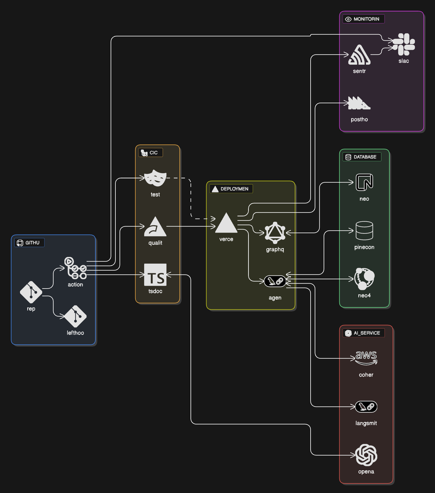

# 🚀 Ben Horner's Portfolio


A modern, AI-powered portfolio website built with Next.js, featuring intelligent chat capabilities, real-time interactions, and a comprehensive tech stack designed for performance and scalability.

## 🏗️ Architecture Overview



This portfolio is built as a monorepo using modern web technologies and follows atomic design principles. The architecture emphasizes type safety, performance, and maintainability across all layers.

## ✨ Features

- **AI-Powered Chat Interface**: Intelligent conversation capabilities using LangGraph and multiple LLM providers
- **Real-time Interactions**: Live chat with typing indicators and message streaming
- **Modern UI/UX**: Built with Tailwind CSS and ShadCN components following atomic design
- **Authentication**: Secure user authentication with Auth0 integration
- **Feature Flags**: Dynamic feature management with PostHog and Statsig
- **Performance Monitoring**: Comprehensive error tracking and analytics with Sentry
- **Responsive Design**: Mobile-first approach with optimized performance
- **Type Safety**: Full TypeScript implementation across all layers

## 🛠️ Tech Stack

### Frontend

- **Next.js 15** - React framework with App Router
- **React 19** - UI library with concurrent features
- **TypeScript** - Type-safe development
- **Tailwind CSS** - Utility-first styling
- **ShadCN/UI** - Component library
- **Zustand** - State management

### Backend & AI

- **LangGraph** - AI agent orchestration
- **OpenAI** - Primary LLM provider
- **Cohere** - Alternative LLM provider
- **Pinecone** - Vector database for embeddings
- **Neo4j** - Graph database for relationships

### Database & Storage

- **Neon** - Serverless PostgreSQL
- **Drizzle ORM** - Type-safe database operations
- **Redis** - Caching and session storage

### Development & Deployment

- **Bun** - Package manager and runtime
- **Turbo** - Monorepo task runner and build system with Vercel integration
- **Vercel** - Deployment platform with remote caching
- **Docker** - Development environment

### Project Management

- **Linear** - Issue tracking and project management with GitHub integration
- **GitHub Actions** - CI/CD automation with bash scripts
- **GitHub Flow** - Branching strategy with feature branches

### Testing & Quality

- **Vitest** - Unit and integration testing
- **Playwright** - End-to-end testing
- **Storybook** - Component documentation
- **Biome** - Linting and formatting

## 🚀 Quick Start

### Prerequisites

- [Bun](https://bun.sh/) (latest version) - Package manager and runtime
- [Docker](https://www.docker.com/) (for local development)
- [Node.js](https://nodejs.org/) 22+ (if not using Bun)

### Installation

1. **Clone the repository**

   ```bash
   git clone https://github.com/benhorner-dev/portfolio.git
   cd portfolio
   ```

2. **Install dependencies**

   ```bash
   bun install
   ```

3. **Set up environment variables**

   ```bash
   cp apps/frontend/example.env apps/frontend/.env.local
   ```

   Configure the following required variables:

   ```env
   # Database
   DATABASE_URL="your-neon-database-url"

   # Authentication
   AUTH0_SECRET="your-auth0-secret"
   AUTH0_CLIENT_ID="your-auth0-client-id"
   AUTH0_CLIENT_SECRET="your-auth0-client-secret"
   AUTH0_DOMAIN="your-auth0-domain"

   # AI Services
   OPENAI_API_KEY="your-openai-api-key"
   COHERE_API_KEY="your-cohere-api-key"

   # Vector Database
   PINECONE_API_KEY="your-pinecone-api-key"

   # Graph Database
   NEO4J_URI="your-neo4j-uri"
   NEO4J_USER="your-neo4j-username"
   NEO4J_PASS="your-neo4j-password"

   # Feature Flags
   STATSIG_SERVER_API_KEY="your-statsig-api-key"
   NEXT_PUBLIC_POSTHOG_KEY="your-posthog-key"

   # Monitoring
   SENTRY_AUTH_TOKEN="your-sentry-auth-token"
   ```

4. **Start the development environment**

   ```bash
   turbo dev
   ```

   This will start:

   - Next.js development server (port 3000)
   - Docker services (databases, Redis)
   - Hot reload for all changes

### Alternative Development Commands

- **Frontend only**: `turbo dev:fe`
- **Run tests**: `turbo test`
- **Run linting**: `turbo lint`
- **Format code**: `turbo format`

### Command Usage

**Bun** is used for:

- **Package management**: `bun install`
- **Runtime**: Executing JavaScript/TypeScript
- **Script execution**: Running individual scripts

**Turbo** is used for:

- **Build all packages**: `turbo build`
- **Run specific task**: `turbo <task-name>`
- **Run with dependencies**: `turbo build --filter=frontend`
- **Clear cache**: `rm -rf ./.turbo/cache`
- **View task graph**: `turbo build --dry-run`
- **Development server**: `turbo dev`

## 📁 Project Structure

```text
portfolio/
├── apps/
│   └── frontend/                 # Next.js application
│       ├── src/
│       │   ├── app/             # App Router pages and API routes
│       │   ├── components/      # Atomic design components
│       │   │   ├── atoms/       # Basic UI elements
│       │   │   ├── molecules/   # Simple component groups
│       │   │   ├── organisms/   # Complex UI sections
│       │   │   └── templates/   # Page layouts
│       │   ├── lib/             # Utilities and business logic
│       │   └── types/           # TypeScript type definitions
│       └── public/              # Static assets
├── docs/                        # Documentation
│   ├── adrs/                    # Architecture Decision Records
│   ├── CODING_STANDARDS.md      # Development guidelines
│   └── TECHNICAL_SPECIFICATIONS.md # Tech stack details
├── tools/                       # Development scripts
│   └── ci/                      # CI/CD bash scripts
├── .github/                     # GitHub workflows and templates
├── turbo.json                   # Turbo monorepo configuration
├── package.json                 # Root package.json with workspaces
└── bun.lock                     # Bun lockfile
```

## 🧪 Testing

The project maintains 100% test coverage for new code with comprehensive testing at all levels:

### Unit Tests

```bash
turbo test:unit
```

### Integration Tests

```bash
turbo test:integration
```

### End-to-End Tests

```bash
turbo test:e2e
```

### All Tests

```bash
turbo test
```

## 🏗️ Development Workflow

### Pre-commit Hooks (Lefthook)

This project uses **Lefthook** for pre-commit hooks to ensure code quality and consistency before commits are made:

#### Installation

1. **Install Lefthook globally**:

   ```bash
   # Using Homebrew (macOS)
   brew install lefthook

   # Using npm
   npm install -g @arkweid/lefthook

   # Using curl
   curl -1sLf 'https://git.io/lefthook' | bash -s
   ```

2. **Install hooks in the project**:
   ```bash
   lefthook install
   ```

#### Available Hooks

The following hooks run automatically before each commit:

- **Linting**: Runs Biome linting on staged files
- **Formatting**: Ensures code follows project formatting standards
- **Type Checking**: Validates TypeScript types
- **Test Execution**: Runs relevant tests for changed files
- **Commit Message Validation**: Ensures conventional commit format

#### Manual Hook Execution

You can run hooks manually without committing:

```bash
# Run all pre-commit hooks
lefthook run pre-commit

# Run specific hook
lefthook run pre-commit --hook lint

# Skip hooks for a commit (not recommended)
git commit --no-verify -m "feat: add feature"
```

#### Configuration

Lefthook configuration is defined in `.lefthook.yml` and includes:

- **Parallel Execution**: Hooks run in parallel for faster execution
- **File Filtering**: Only runs on relevant file types
- **Error Handling**: Stops commit if any hook fails
- **Performance**: Optimized for monorepo structure

### Code Quality Standards

- **TypeScript**: Strict mode enabled, no `any` types allowed
- **Testing**: 100% coverage requirement for new code
- **Linting**: Biome for fast linting and formatting
- **Commits**: Conventional commit format required
- **PR Size**: Maximum 800 lines of changes per PR

### Semantic Release & Versioning

This project uses **Semantic Release** for automated version management:

- **Conventional Commits**: All commits must follow [Conventional Commits](https://www.conventionalcommits.org/) specification
- **Automatic Versioning**: Version numbers are automatically determined from commit messages
- **Changelog Generation**: Automatic changelog creation from commit history
- **GitHub Releases**: Automatic release creation with generated notes
- **Deployment Integration**: Releases trigger automatic deployments

#### Commit Types

- `feat:` - New features (triggers minor version bump)
- `fix:` - Bug fixes (triggers patch version bump)
- `docs:` - Documentation changes (no version bump)
- `style:` - Code style changes (no version bump)
- `refactor:` - Code refactoring (no version bump)
- `perf:` - Performance improvements (triggers patch version bump)
- `test:` - Test additions/changes (no version bump)
- `chore:` - Build process or auxiliary tool changes (no version bump)
- `BREAKING CHANGE:` - Breaking changes (triggers major version bump)

#### Example Commits

```bash
feat(auth): add JWT token validation
fix(payment): resolve null pointer exception in payment processor
docs(api): update authentication endpoint documentation
test(user): add unit tests for user registration
BREAKING CHANGE: migrate to PostgreSQL 14
```

### Git Workflow (GitHub Flow)

We follow **GitHub Flow** with **Linear ticket integration** for seamless issue tracking:

#### Branching Strategy

1. **Create feature branch** from `main` with Linear ticket reference:

   ```bash
   # Feature branch
   git checkout -b feature/PORT-16-add-btn

   # Bug fix branch
   git checkout -b fix/PORT-23-resolve-payment-error

   # Hotfix branch
   git checkout -b hotfix/PORT-45-critical-security-patch
   ```

2. **Branch Naming Convention**:

   - `feature/PORT-{ticket-number}-{description}`
   - `fix/PORT-{ticket-number}-{description}`
   - `hotfix/PORT-{ticket-number}-{description}`
   - `docs/PORT-{ticket-number}-{description}`
   - `refactor/PORT-{ticket-number}-{description}`

3. **Linear Integration**:
   - **Auto-linking**: Branch names automatically link to Linear tickets
   - **PR Integration**: Pull requests automatically reference Linear issues
   - **Status Updates**: Linear tickets update based on PR status
   - **Traceability**: Complete audit trail from ticket to deployment

#### Development Process

1. **Create branch** with Linear ticket reference
2. **Make changes** with proper testing
3. **Run quality checks**: `turbo lint && turbo test`
4. **Commit** using conventional commit format: `type(scope): description`
5. **Push branch** and create pull request
6. **Code review** and approval required
7. **Merge to main** triggers full CI/CD pipeline

### CI/CD Pipeline

The project uses **GitHub Actions** with **bash scripts** for platform-agnostic automation:

> **Note**: The Mermaid diagram below visualizes the complete CI/CD pipeline flow from Linear ticket creation to production deployment.


#### Pipeline Stages

#### PR Pipeline

- **All Tests**: Unit, integration, and e2e tests
- **Build Verification**: Complete build process validation
- **Linting**: Code quality and style checks
- **Preview Deployment**: Automatic preview environment
- **Preview Database Migration**: Test database schema changes

#### Main Branch Pipeline

- **Full Test Suite**: Comprehensive testing across all environments
- **Production Build**: Optimized production build verification
- **Documentation Generation**: Auto-generate API docs with LLM-injected TSDoc
- **Semantic Release**: Automatic versioning and changelog generation
- **Production Deployment**: Deploy to live environment

#### Bash Script Architecture

- **Platform Agnostic**: Works across different operating systems
- **Modular Design**: Reusable scripts in `tools/ci/` directory
- **Error Handling**: Robust error handling and logging
- **Environment Management**: Automated environment setup and teardown

### Environment Strategy

- **Local**: Full development environment with Docker
- **Preview**: PR-based preview environments with database migrations
- **Production**: Live deployment with comprehensive monitoring

## 📚 Documentation

- [Technical Specifications](docs/TECHNICAL_SPECIFICATIONS.md) - Detailed tech stack and architecture decisions
- [Coding Standards](docs/CODING_STANDARDS.md) - Development guidelines and best practices
- [API Documentation](https://github.com/benhorner-dev/portfolio/wiki) - Auto-generated API docs with LLM-injected TSDoc comments
- [Architecture Decision Records (ADRs)](docs/adrs/) - Major architectural decisions and rationale

### Auto-Generated Documentation

This project uses **automated documentation generation** to minimize maintenance overhead:

- **TypeDoc Integration**: Auto-generates comprehensive API documentation from TypeScript code
- **LLM-Injected TSDoc**: AI-generated documentation comments during CI/CD
- **GitHub Wiki**: Automatically updated with latest code documentation
- **Zero Maintenance**: No manual TSDoc comments needed in codebase
- **Always Current**: Documentation stays in sync with code changes

### Architecture Decision Records (ADRs)

When making major architectural decisions, document them using ADRs:

- **Location**: `docs/adrs/` directory
- **Format**: Markdown files with standardized structure
- **Purpose**: Capture the context, decision, and consequences of major choices
- **Examples**: Technology selections, architectural patterns, integration decisions

## 🚀 Deployment

The application uses **Semantic Release** for automated deployment to Vercel with **Turbo's advanced monorepo management**:

- **Automatic Releases**: Every merge to `main` triggers semantic release
- **Version Management**: Automatic version bumping based on commit types
- **Changelog**: Auto-generated release notes from conventional commits
- **GitHub Releases**: Automatic release creation with detailed notes
- **Vercel Deployment**: Automatic deployment after successful release
- **Preview Deployments**: Feature branches get preview deployments
- **Remote Caching**: Turbo's Vercel integration for faster builds

### Release Process

1. **Commit**: Use conventional commit format
2. **Merge**: Merge to `main` branch
3. **Analyze**: Semantic release analyzes commit messages
4. **Version**: Automatically determines next version number
5. **Release**: Creates GitHub release with changelog
6. **Deploy**: Triggers Vercel deployment

### Turbo + Vercel Integration

This monorepo leverages **Turbo's Vercel integration** for optimal performance:

#### Remote Caching Setup

1. **Authenticate with Vercel**:

   ```bash
   bunx turbo login
   ```

2. **Link your repository**:

   ```bash
   bunx turbo link
   ```

3. **Verify remote caching**:

   ```bash
   # Make a change and build
   turbo build

   # Clear local cache
   rm -rf ./.turbo/cache

   # Build again - should use remote cache
   turbo build
   ```

#### Benefits of Turbo + Vercel

- **Remote Caching**: Share build artifacts across team and CI/CD
- **Incremental Builds**: Only rebuild what changed
- **Parallel Execution**: Run tasks in parallel for faster builds
- **Dependency Graph**: Smart task ordering based on dependencies
- **Vercel Integration**: Seamless deployment with cached builds

#### Turbo Configuration

The `turbo.json` file defines:

- **Task Dependencies**: Build order and relationships
- **Environment Variables**: Required env vars per task
- **Output Caching**: What to cache and share
- **Parallel Execution**: Which tasks can run concurrently

### Manual Deployment

```bash
# Build the application
turbo build

# Start production server
turbo start

# Run semantic release manually (if needed)
bun run semantic-release
```

## 🔧 Configuration

### Feature Flags

The application uses multiple feature flag providers:

- **PostHog**: Client-side feature flags
- **Statsig**: Server-side feature flags

### Environment Variables

All configuration is managed through environment variables using **Vercel CLI** for secure secret management:

#### Local Development

1. **Copy example environment file**:

   ```bash
   cp apps/frontend/example.env apps/frontend/.env.local
   ```

2. **Pull environment variables from Vercel**:

   ```bash
   # Install Vercel CLI
   bun i -g vercel

   # Login to Vercel
   vercel login

   # Pull environment variables
   vercel env pull apps/frontend/.env.local
   ```

3. **Environment-specific variables**:
   - **Development**: Local `.env.local` files
   - **Preview**: Vercel preview environment variables
   - **Production**: Vercel production environment variables

#### Secret Management

- **Vercel Dashboard**: Manage secrets through Vercel's secure dashboard
- **CLI Management**: Use `vercel env` commands for programmatic access
- **Team Collaboration**: Environment variables are shared across team members
- **Security**: Secrets are encrypted and never exposed in code or logs

#### Required Environment Variables

See `apps/frontend/example.env` for the complete list of required variables including:

- Database connections (Neon PostgreSQL)
- Authentication (Auth0)
- AI services (OpenAI, Cohere)
- Vector databases (Pinecone)
- Graph databases (Neo4j)
- Monitoring (Sentry, PostHog)
- Feature flags (Statsig)

## 🤝 Contributing

1. **Create Linear Ticket**: Start with a ticket in Linear for tracking
2. **Fork the repository** (if external contributor)
3. **Create feature branch** with Linear ticket reference:

   ```bash
   git checkout -b feature/PORT-16-amazing-feature
   ```

4. **Make your changes** following the coding standards
5. **Add tests** for new functionality
6. **Run the test suite**: `turbo test`
7. **Commit using conventional format**: `git commit -m 'feat: add amazing feature'`
8. **Push to your branch**: `git push origin feature/PORT-123-amazing-feature`
9. **Open a Pull Request** with conventional commit title and Linear ticket reference

### Linear Integration

- **Ticket Reference**: Always include `PORT-{number}` in branch names
- **Auto-linking**: Branches and PRs automatically link to Linear tickets
- **Status Updates**: Linear tickets update based on PR and deployment status
- **Traceability**: Complete audit trail from ticket creation to deployment

### Commit Message Format

**Required**: All commits must follow [Conventional Commits](https://www.conventionalcommits.org/) specification:

```text
<type>[optional scope]: <description>

[optional body]

[optional footer(s)]
```

**Examples:**

- `feat(auth): add JWT token validation`
- `fix(payment): resolve null pointer exception`
- `docs(readme): update installation instructions`
- `BREAKING CHANGE: migrate to PostgreSQL 14`

## 📄 License

This project is licensed under the MIT License - see the [LICENSE](LICENSE.md) file for details.

## 🔗 Links

- **Live Site**: [benhorner.dev](https://benhorner.dev)
- **Documentation**: [GitHub Wiki](https://github.com/benhorner-dev/portfolio/wiki)
- **Issues**: [GitHub Issues](https://github.com/benhorner-dev/portfolio/issues)

## 📞 Contact

- **Email**: [ben@benhorner.dev](mailto:ben@benhorner.dev)
- **LinkedIn**: [Ben Horner](https://linkedin.com/in/benhorner)
- **GitHub**: [@benhorner-dev](https://github.com/benhorner-dev)

---

Built with ❤️ using modern web technologies and best practices.
