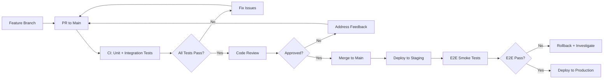

# Coding Standards

## Table of Contents

### 1. Code Architecture & Design
- [1.1 Design Patterns & Clean Code Philosophy](#11-design-patterns--clean-code-philosophy)
- [1.2 Atomic Design Pattern](#12-atomic-design-pattern)
- [1.3 Repository Structure Standards](#13-repository-structure-standards)

### 2. Code Quality & Standards
- [2.1 Function Design Principles](#21-function-design-principles)
- [2.2 Error Handling](#22-error-handling)
- [2.3 Control Flow](#23-control-flow)
- [2.4 Import Management](#24-import-management)
- [2.5 Function Declaration Style](#25-function-declaration-style)
- [2.6 Type Organization](#26-type-organization)
- [2.7 Configuration Management](#27-configuration-management)
- [2.8 Code Documentation](#28-code-documentation)

### 3. Testing & Quality Assurance
- [3.1 Testing Requirements](#31-testing-requirements)
- [3.2 Code Quality & Static Analysis](#32-code-quality--static-analysis)

### 4. Development Workflow
- [4.1 Branching Strategy](#41-branching-strategy)
- [4.2 Commit Standards](#42-commit-standards)
- [4.3 Pull Request Process](#43-pull-request-process)
- [4.4 Environment Strategy](#44-environment-strategy)

### 5. CI/CD & Deployment
- [5.1 Pipeline Requirements](#51-pipeline-requirements)
- [5.2 Enforcement](#52-enforcement)

---

## 1. Code Architecture & Design

### 1.1 Design Patterns & Clean Code Philosophy

#### Pragmatism Over Dogmatism

**Core Principle**: We love design patterns, but when faced with a choice between dogmatism and pragmatism, **choose pragmatism**.

Design patterns are tools to solve problems, not goals in themselves. Don't force patterns where they don't naturally fit or add unnecessary complexity just to maintain theoretical purity.

#### Avoiding Over-Engineering

##### Example 1: Repository Pattern

###### Bad Example: Dogmatic Repository

```typescript
// Over-engineered - forcing repository pattern everywhere
interface UserRepository {
  findById(id: string): Promise<User>;
  findAll(): Promise<User[]>;
  save(user: User): Promise<void>;
  delete(id: string): Promise<void>;
  findByEmail(email: string): Promise<User>;
  findByStatus(status: string): Promise<User[]>;
  findByDateRange(start: Date, end: Date): Promise<User[]>;
  findWithPagination(page: number, size: number): Promise<User[]>;
}

class DatabaseUserRepository implements UserRepository {
  // 8 methods, most just simple database calls
  async findById(id: string): Promise<User> {
    return await db.users.findUnique({ where: { id } });
  }

  async findByEmail(email: string): Promise<User> {
    return await db.users.findUnique({ where: { email } });
  }
  // ... 6 more simple wrapper methods
}

class UserService {
  constructor(private userRepo: UserRepository) {}

  async getUser(id: string) {
    return await this.userRepo.findById(id); // Just passing through
  }
}
```

###### Good Example: Pragmatic Approach

```typescript
// Simple and direct - use repository only when it adds value
class UserService {
  async getUser(id: string): Promise<User> {
    return await db.users.findUnique({ where: { id } });
  }

  async getUserByEmail(email: string): Promise<User> {
    return await db.users.findUnique({ where: { email } });
  }

  // Use repository pattern only for complex operations
  async getUsersWithComplexFiltering(filters: UserFilters): Promise<User[]> {
    return await this.userRepository.findWithAdvancedFiltering(filters);
  }
}

// Repository only for genuinely complex operations
class UserRepository {
  async findWithAdvancedFiltering(filters: UserFilters): Promise<User[]> {
    // Complex query building with joins, subqueries, etc.
    const query = this.buildComplexQuery(filters);
    return await db.$queryRaw(query);
  }
}
```

##### Example 2: Factory Pattern

###### Bad Example: Dogmatic Factory

```typescript
// Over-abstracted - factory for simple object creation
interface NotificationFactory {
  createNotification(type: string, message: string): Notification;
}

class ConcreteNotificationFactory implements NotificationFactory {
  createNotification(type: string, message: string): Notification {
    switch (type) {
      case 'email':
        return new EmailNotification(message);
      case 'sms':
        return new SmsNotification(message);
      case 'push':
        return new PushNotification(message);
      default:
        throw new Error(`Unknown notification type: ${type}`);
    }
  }
}

// Every notification creation goes through the factory
function sendWelcomeEmail(user: User) {
  const factory = new ConcreteNotificationFactory();
  const notification = factory.createNotification('email', 'Welcome!');
  notification.send(user.email);
}
```

###### Good Example: Pragmatic Approach

```typescript
// Direct instantiation for simple cases
function sendWelcomeEmail(user: User) {
  const notification = new EmailNotification('Welcome!');
  notification.send(user.email);
}

// Factory only when creation logic is complex
class NotificationManager {
  createNotificationFromTemplate(
    templateId: string,
    user: User,
    data: Record<string, any>
  ): Notification {
    const template = this.getTemplate(templateId);
    const content = this.renderTemplate(template, data);
    const preferences = this.getUserPreferences(user);

    // Complex creation logic that justifies a factory
    if (preferences.urgent && template.supportsPush) {
      return new PushNotification(content, { priority: 'high' });
    } else if (template.type === 'marketing' && preferences.emailMarketing) {
      return new EmailNotification(content, { tracking: true });
    } else {
      return new SmsNotification(content);
    }
  }
}
```

##### Example 3: Observer Pattern

###### Bad Example: Dogmatic Observer

```typescript
// Over-engineered for simple state changes
interface Observer {
  update(event: string, data: any): void;
}

class OrderObserver implements Observer {
  update(event: string, data: any): void {
    switch (event) {
      case 'order_created':
        console.log(`Order ${data.id} created`);
        break;
      case 'order_updated':
        console.log(`Order ${data.id} updated`);
        break;
    }
  }
}

class Order {
  private observers: Observer[] = [];

  addObserver(observer: Observer): void {
    this.observers.push(observer);
  }

  private notify(event: string, data: any): void {
    this.observers.forEach(observer => observer.update(event, data));
  }

  create(): void {
    // Simple creation logic
    this.id = generateId();
    this.notify('order_created', this);
  }
}

// Usage requires setting up observers for simple operations
const order = new Order();
order.addObserver(new OrderObserver());
order.create();
```

###### Good Example: Pragmatic Approach

```typescript
// Simple callbacks for simple cases
class Order {
  create(onCreated?: (order: Order) => void): void {
    this.id = generateId();
    onCreated?.(this);
  }
}

// Observer pattern only for complex event systems
class OrderEventSystem {
  private eventHandlers = new Map<string, Array<(data: any) => void>>();

  on(event: string, handler: (data: any) => void): void {
    if (!this.eventHandlers.has(event)) {
      this.eventHandlers.set(event, []);
    }
    this.eventHandlers.get(event)!.push(handler);
  }

  emit(event: string, data: any): void {
    this.eventHandlers.get(event)?.forEach(handler => handler(data));
  }
}

class ComplexOrder {
  constructor(private eventSystem: OrderEventSystem) {}

  processWorkflow(): void {
    // Complex workflow with multiple state changes
    this.validateOrder();
    this.eventSystem.emit('order_validated', this);

    this.processPayment();
    this.eventSystem.emit('payment_processed', this);

    this.allocateInventory();
    this.eventSystem.emit('inventory_allocated', this);

    // Many more complex steps...
  }
}
```

##### Example 4: Dependency Injection

###### Bad Example: Dogmatic DI

```typescript
// Over-injecting everything, even simple utilities
interface DateProvider {
  getCurrentDate(): Date;
}

interface RandomProvider {
  generateRandom(): number;
}

interface LoggerProvider {
  log(message: string): void;
}

class UserService {
  constructor(
    private dateProvider: DateProvider,
    private randomProvider: RandomProvider,
    private logger: LoggerProvider,
    private userRepository: UserRepository
  ) {}

  createUser(name: string): User {
    this.logger.log('Creating user'); // Just console.log
    return {
      id: this.randomProvider.generateRandom(), // Just Math.random()
      name,
      createdAt: this.dateProvider.getCurrentDate() // Just new Date()
    };
  }
}
```

###### Good Example: Pragmatic Approach

```typescript
// Inject only what needs to be mocked or configured
class UserService {
  constructor(private userRepository: UserRepository) {}

  createUser(name: string): User {
    console.log('Creating user'); // Direct call for simple logging
    return {
      id: Math.random(), // Direct call for simple operations
      name,
      createdAt: new Date() // Direct instantiation
    };
  }

  // Inject complex dependencies that vary or need mocking
  async validateUserWithExternalService(
    user: User,
    validationService: ExternalValidationService
  ): Promise<boolean> {
    return await validationService.validate(user);
  }
}
```

#### Design Pattern Guidelines

**When to Use Patterns:**

- **Solve Real Problems**: Use patterns to address actual complexity, not theoretical future needs
- **Improve Readability**: Pattern should make code easier to understand, not harder
- **Reduce Duplication**: Pattern should eliminate meaningful duplication, not create artificial interfaces
- **Enable Extension**: Use patterns when you genuinely need extensibility

**When to Avoid Patterns:**

- **Premature Abstraction**: Don't abstract until you have at least 3 similar use cases
- **Forced Consistency**: Don't make dissimilar things look similar just for pattern compliance
- **Over-Engineering**: Simple if/else statements are often better than complex pattern implementations
- **Pattern for Pattern's Sake**: Don't use patterns just because they exist

#### Clean Code Principles

**Favor Clarity Over Cleverness:**

```tsx
// Clever but unclear
const users = users.filter(u => u.roles.some(r => r.name === 'admin'));

// Clear and readable
const hasAdminRole = (user: User): boolean => {
  return user.roles.some(role => role.name === 'admin');
};
const adminUsers = users.filter(hasAdminRole);
```

**Simple Solutions First:**

```tsx
// Over-engineered for simple use case
interface Logger {
  log(message: string): void;
}

class ConsoleLogger implements Logger {
  log(message: string): void {
    console.log(message);
  }
}

class LoggerFactory {
  static create(): Logger {
    return new ConsoleLogger();
  }
}

// Simple and sufficient
const log = (message: string): void => {
  console.log(message);
};
```

**Rule of Three**: Don't abstract until you have three similar implementations. Two might be coincidence, three indicates a pattern.

### 1.2 Atomic Design Pattern

#### Core Philosophy

**Build interfaces as hierarchical systems rather than collections of pages**

Atomic design provides a methodology for creating interface design systems in a deliberate and hierarchical manner, moving between abstract and concrete thinking.

#### Five Stages of Atomic Design

##### Atoms
- **Definition**: Basic HTML elements that cannot be broken down further without losing functionality
- **Examples**: Form labels, inputs, buttons, headings, icons
- **Purpose**: Foundational building blocks with their own intrinsic properties
- **Usage**: Demonstrate all base styles at a glance in pattern libraries

```tsx
// Atom examples
const Button = ({ children, variant = 'primary' }) => (
  <button className={`btn btn-${variant}`}>{children}</button>
);

const Input = ({ type = 'text', placeholder, ...props }) => (
  <input type={type} placeholder={placeholder} {...props} />
);

const Label = ({ htmlFor, children }) => (
  <label htmlFor={htmlFor}>{children}</label>
);
```

##### Molecules
- **Definition**: Simple groups of atoms functioning together as a unit
- **Examples**: Search form (label + input + button), card header (avatar + title + subtitle)
- **Purpose**: Create reusable components that adhere to single responsibility principle
- **Benefits**: Easier testing, encourages reusability, promotes consistency

```tsx
// Molecule example - Search Form
const SearchForm = ({ onSubmit }) => (
  <form onSubmit={onSubmit} className="search-form">
    <Label htmlFor="search">Search</Label>
    <Input id="search" type="search" placeholder="Enter search term" />
    <Button type="submit">Search</Button>
  </form>
);
```

##### Organisms
- **Definition**: Complex components composed of groups of molecules, atoms, and other organisms
- **Examples**: Header (logo + navigation + search), product grid, comment section
- **Purpose**: Form distinct sections of an interface with contextual meaning
- **Characteristics**: Can consist of similar or different molecule types

```tsx
// Organism example - Header
const Header = ({ logo, navigation, user }) => (
  <header className="site-header">
    <Logo {...logo} />
    <Navigation items={navigation} />
    <SearchForm onSubmit={handleSearch} />
    <UserMenu user={user} />
  </header>
);
```

##### Templates
- **Definition**: Page-level objects that place components into a layout structure
- **Purpose**: Articulate the design's underlying content structure (not final content)
- **Focus**: Content structure skeleton rather than actual content
- **Benefits**: Account for dynamic content while providing necessary guardrails

```tsx
// Template example - Homepage Template
const HomepageTemplate = ({ hero, features, testimonials, footer }) => (
  <div className="homepage">
    <HeroOrganism {...hero} />
    <FeaturesOrganism items={features} />
    <TestimonialsOrganism items={testimonials} />
    <FooterOrganism {...footer} />
  </div>
);
```

##### Pages
- **Definition**: Specific instances of templates with real representative content
- **Purpose**: Show what UI looks like with actual content, test design system effectiveness
- **Benefits**: Final validation, stakeholder sign-off, reveals content-related issues
- **Testing**: Validate that patterns hold up with real content variations

```tsx
// Page example - Actual Homepage
const Homepage = () => {
  const pageData = useHomepageData();

  return (
    <HomepageTemplate
      hero={pageData.hero}
      features={pageData.features}
      testimonials={pageData.testimonials}
      footer={pageData.footer}
    />
  );
};
```

#### Implementation Guidelines

##### Directory Structure
```
src/
  components/
    atoms/
      Button/
      Input/
      Label/
    molecules/
      SearchForm/
      ProductCard/
      UserMenu/
    organisms/
      Header/
      ProductGrid/
      Footer/
    templates/
      HomepageTemplate/
      ProductPageTemplate/
    pages/
      Homepage/
      ProductPage/
```

#### Key Benefits

**Traversal Between Abstract and Concrete**
- Simultaneously see interfaces broken down to elements and combined into experiences
- Switch contexts like a painter moving between detailed work and overall composition

**Clean Separation of Structure and Content**
- Templates define content structure skeleton
- Pages demonstrate real content application
- Both influence each other iteratively

**Hierarchical Thinking**
- Atoms → Molecules → Organisms provides clear hierarchy
- Components serve specific purposes at each level
- Scalable system that grows with complexity

#### Best Practices

- **Non-Linear Process**: Don't build atoms first, then molecules. Think of stages as concurrent mental model
- **Content Awareness**: Design patterns must reflect the nature of content that lives inside them
- **Reusability**: Focus on creating portable, reusable components
- **Testing**: Each level should be independently testable
- **Documentation**: Maintain pattern library showing all levels in context

### 1.3 Repository Structure Standards

#### Core Directory Structure

##### Source Code Organization
```
src/                     # Source code (no headers/framework files)
test/                   # Unit tests, integration tests
.config/                # Local machine configuration
.build/                 # Build process scripts (Docker, PowerShell)
dep/                    # Dependencies storage
doc/                    # Documentation
res/                    # Static resources (images, assets)
samples/                # "Hello World" code supporting documentation
tools/                  # Automation scripts (.sh, .cmd files)
```

##### Git Configuration Files

```
.gitignore              # Files for git to ignore
.gitattributes         # File attributes (diff behavior, etc.)
.mailmap               # Author name/email normalization
.gitmodules            # Submodule definitions
```

##### GitHub Special Files

###### Root Level Files
```
README.md              # Project overview: What, Why, How
LICENSE                # Legal licensing information
CHANGELOG.md           # Version updates, bug fixes, changes
CONTRIBUTORS.md        # People who contributed to the repo
AUTHORS.md             # Legally significant authors
SUPPORT.md             # How to get help (linked on New Issue)
SECURITY.md            # Security policies and vulnerability reporting
CODE_OF_CONDUCT.md     # Community engagement rules
CONTRIBUTING.md        # How to contribute (linked on New PR)
ACKNOWLEDGMENTS.md     # Related work, dependencies, credits
CODEOWNERS             # Code ownership for PR reviews
```

###### Templates
```
ISSUE_TEMPLATE/        # Directory for multiple issue templates
  bug-report.md
  feature-request.md
  documentation.md

PULL_REQUEST_TEMPLATE.md  # PR template (or directory for multiple)
```

##### .github Directory Structure

**Purpose**: Convention folder for GitHub-related configurations

```
.github/
  CODE_OF_CONDUCT.md
  CONTRIBUTING.md
  FUNDING.yml              # Sponsorship/funding information
  SECURITY.md
  PULL_REQUEST_TEMPLATE.md
  ISSUE_TEMPLATE/          # Issue templates directory
    bug-report.md
    feature-request.md
  CODEOWNERS
  workflows/               # GitHub Actions YAML files
    ci.yml
    deploy.yml
    security-scan.yml
```

##### File Naming Conventions

**Uppercase Files**: Standard for GitHub recognition
- README, LICENSE, CHANGELOG, CONTRIBUTORS, AUTHORS
- SUPPORT, SECURITY, CODE_OF_CONDUCT, CONTRIBUTING
- ACKNOWLEDGMENTS, CODEOWNERS

**File Extensions**: Use .md for formatting, .txt for plain text, or no extension
- README.md (preferred for formatting)
- LICENSE (no extension common)
- CHANGELOG.md (for formatting)

#### Implementation Guidelines

##### Required Files for All Repositories
1. **README.md** - Clear project description and setup instructions
2. **LICENSE** - Legal licensing (use choosealicense.com)
3. **CONTRIBUTING.md** - Contribution guidelines and process
4. **CODE_OF_CONDUCT.md** - Community standards
5. **PULL_REQUEST_TEMPLATE.md** - PR template from your standards
6. **.gitignore** - Generated from gitignore.io

##### Optional but Recommended
- **CHANGELOG.md** - For projects with releases
- **SECURITY.md** - For projects handling sensitive data
- **CODEOWNERS** - For team repositories with defined ownership
- **FUNDING.yml** - For open source projects seeking sponsorship

##### Directory Structure Example

```
project-root/
├── .github/
│   ├── workflows/
│   │   └── ci.yml
│   ├── ISSUE_TEMPLATE/
│   │   ├── bug-report.md
│   │   └── feature-request.md
│   ├── PULL_REQUEST_TEMPLATE.md
│   ├── CODEOWNERS
│   └── FUNDING.yml
├── .build/
│   ├── docker-compose.yml
│   └── build.sh
├── .config/
│   └── local-settings.json
├── dep/
├── doc/
│   └── api/
├── res/
│   └── images/
├── samples/
│   └── hello-world/
├── src/
│   ├── components/
│   ├── services/
│   └── utils/
├── test/
│   ├── unit/
│   └── integration/
├── tools/
│   ├── deploy.sh
│   └── setup.cmd
├── .gitignore
├── .gitattributes
├── README.md
├── LICENSE
├── CONTRIBUTING.md
├── CODE_OF_CONDUCT.md
├── CHANGELOG.md
└── package.json
```

##### Benefits

**Standardization**: Consistent structure across all repositories
**Discoverability**: GitHub automatically surfaces special files
**Automation**: Proper structure enables better tooling and CI/CD
**Collaboration**: Clear contribution guidelines and templates
**Maintenance**: Well-organized code is easier to maintain and understand

---

## 2. Code Quality & Standards

### 2.1 Function Design Principles

#### Function Parameter Count

**Guideline: Limit functions to 3 parameters or fewer**

- **0-1 parameters**: Ideal (niladic/monadic functions)
- **2 parameters**: Good (dyadic functions)
- **3 parameters**: Acceptable but requires careful consideration (triadic functions)
- **4+ parameters**: Avoid - indicates the function is likely doing too much

**When you have many parameters:**
- Group related parameters into objects/structs
- Consider if the function violates single responsibility
- Use parameter objects or configuration objects
- Split the function into smaller, more focused functions

```jsx
// Poor
function createUser(name, email, age, address, phone, role, department) { }

// Better
function createUser(userInfo, contactInfo, organizationInfo) { }

// or
function createUser(userProfile) { }
```

#### Single Responsibility Principle (SRP)

**Definition: A function should have one reason to change**

##### Core Guidelines:

- Each function should do **one thing** and do it well
- Functions should operate at the **same level of abstraction**
- Don't mix **high-level business logic** with **low-level implementation details**
- Don't mix **different concerns** (data access, business logic, formatting, etc.)

##### Same Level of Abstraction:

```jsx
// Poor - mixing abstraction levels
function processOrder(order) {
  // High level
  validateOrder(order);
  // Low level database details mixed in
  const connection = mysql.createConnection(config);
  connection.query('INSERT INTO orders...', order);
  // High level
  sendConfirmationEmail(order);
}

// Better - consistent abstraction level
function processOrder(order) {
  validateOrder(order);
  saveOrder(order); // Hide DB implementation
  sendConfirmationEmail(order);
}
```

##### Avoid Mixed Concerns:

- Don't mix data validation with data persistence
- Don't mix business logic with presentation logic
- Don't mix error handling with core functionality

### 2.2 Error Handling

#### Fail Fast Error Handling

**Philosophy: Detect errors early, let them propagate, handle them at appropriate boundaries**

##### Core Principles:

1. **Validate inputs immediately** - fail at the boundary
2. **Don't catch errors unless you can meaningfully handle them**
3. **Let errors bubble up** to appropriate handlers
4. **Use custom error types** for specific error scenarios
5. **Centralize error handling** at high levels of abstraction

##### Implementation Pattern:

```jsx
// Low-level functions: validate and throw
function withdrawMoney(account, amount) {
  if (amount <= 0) {
    throw new InvalidAmountError('Amount must be positive');
  }
  if (account.balance < amount) {
    throw new InsufficientFundsError('Not enough funds');
  }
  // Core logic here
  account.balance -= amount;
  return account;
}

// Mid-level: let errors propagate
function processWithdrawal(accountId, amount) {
  const account = getAccount(accountId); // May throw AccountNotFoundError
  return withdrawMoney(account, amount); // May throw withdrawal errors
}

// High-level: catch and handle appropriately
function handleWithdrawalRequest(request) {
  try {
    const result = processWithdrawal(request.accountId, request.amount);
    return { success: true, data: result };
  } catch (error) {
    if (error instanceof InsufficientFundsError) {
      logger.warn('Withdrawal failed: insufficient funds', {
        accountId: request.accountId,
        amount: request.amount
      });
      return { success: false, error: 'Insufficient funds' };
    }
    if (error instanceof InvalidAmountError) {
      logger.warn('Invalid withdrawal amount', { amount: request.amount });
      return { success: false, error: 'Invalid amount' };
    }
    // Unexpected errors bubble up to global handler
    throw error;
  }
}
```

##### Custom Error Types:

```jsx
class DomainError extends Error {
  constructor(message, code) {
    super(message);
    this.name = this.constructor.name;
    this.code = code;
  }
}

class ValidationError extends DomainError { }
class BusinessRuleError extends DomainError { }
class ResourceNotFoundError extends DomainError { }
```


#### Error Boundaries For FE

##### Requirement

Wrap all organisms in error boundaries to prevent component failures from crashing the entire application.

##### Implementation

###### Base Error Boundary Component

```typescript
// components/ErrorBoundary.tsx
interface Props {
  children: React.ReactNode;
  fallback?: React.ComponentType<{ error?: Error }>;
  onError?: (error: Error, errorInfo: React.ErrorInfo) => void;
}

interface State {
  hasError: boolean;
  error?: Error;
}

export class ErrorBoundary extends React.Component<Props, State> {
  constructor(props: Props) {
    super(props);
    this.state = { hasError: false };
  }

  static getDerivedStateFromError(error: Error): State {
    return { hasError: true, error };
  }

  componentDidCatch(error: Error, errorInfo: React.ErrorInfo) {
    this.props.onError?.(error, errorInfo);
    // Log to monitoring service (e.g., Sentry)
    console.error('ErrorBoundary caught an error:', error, errorInfo);
  }

  render() {
    if (this.state.hasError) {
      const Fallback = this.props.fallback || DefaultErrorFallback;
      return <Fallback error={this.state.error} />;
    }
    return this.props.children;
  }
}
```

###### Default Fallback Component

```typescript
// components/DefaultErrorFallback.tsx
interface Props {
  error?: Error;
}

const DefaultErrorFallback: React.FC<Props> = ({ error }) => (
  <div className="error-fallback">
    <h3>Something went wrong</h3>
    <p>Unable to load this section. Please try refreshing the page.</p>
    {process.env.NODE_ENV === 'development' && (
      <details>
        <summary>Error details</summary>
        <pre>{error?.message}</pre>
      </details>
    )}
  </div>
);
```

##### Usage Guidelines

###### Primary Boundaries (Organisms)
Wrap each organism component with an error boundary:

```typescript
// organisms/ProductCard/index.tsx
<ErrorBoundary
  fallback={ProductCardError}
  onError={(error, errorInfo) => logError('ProductCard', error, errorInfo)}
>
  <ProductCard {...props} />
</ErrorBoundary>
```

###### Secondary Boundaries (Templates)
Add page-level boundaries in templates when needed:

```typescript
// templates/ProductPageTemplate.tsx
<ErrorBoundary fallback={PageError} onError={logPageError}>
  <ProductPageTemplate>
    <ProductDetailsOrganism />
    <ReviewsOrganism />
    <RecommendationsOrganism />
  </ProductPageTemplate>
</ErrorBoundary>
```

###### Standards

1. **Always provide meaningful fallback UI** - Never show blank screens
2. **Log errors to monitoring service** - Use structured logging with context
3. **Test error boundaries** - Include error-throwing components in tests
4. **Graceful degradation** - Fallback UI should maintain page functionality where possible
5. **Development vs Production** - Show detailed errors only in development

###### Testing

```typescript
// __tests__/ErrorBoundary.test.tsx
const ThrowError: React.FC<{ shouldThrow: boolean }> = ({ shouldThrow }) => {
  if (shouldThrow) {
    throw new Error('Test error');
  }
  return <div>No error</div>;
};

test('renders fallback UI when error occurs', () => {
  const onError = jest.fn();
  render(
    <ErrorBoundary fallback={TestFallback} onError={onError}>
      <ThrowError shouldThrow={true} />
    </ErrorBoundary>
  );

  expect(screen.getByText('Error occurred')).toBeInTheDocument();
  expect(onError).toHaveBeenCalled();
});
```

### 2.3 Control Flow

#### Flat Logic with Early Returns

**Goal: Eliminate nested conditions and improve readability**

##### Guard Clauses Pattern:

```jsx
// Poor - nested logic
function calculateDiscount(user, order) {
  if (user) {
    if (user.isPremium) {
      if (order.total > 100) {
        if (order.items.length > 5) {
          return order.total * 0.15;
        } else {
          return order.total * 0.10;
        }
      } else {
        return order.total * 0.05;
      }
    } else {
      return 0;
    }
  } else {
    throw new Error('User required');
  }
}

// Better - early returns
function calculateDiscount(user, order) {
  if (!user) {
    throw new ValidationError('User required');
  }
  if (!user.isPremium) {
    return 0;
  }
  if (order.total <= 100) {
    return order.total * 0.05;
  }
  if (order.items.length > 5) {
    return order.total * 0.15;
  }
  return order.total * 0.10;
}
```

##### Benefits of Early Returns:

- **Reduces cognitive load** - fewer nested conditions to track
- **Makes error conditions explicit** - guard clauses at the top
- **Improves readability** - linear flow of logic
- **Easier to test** - clear paths through the function
- **Self-documenting** - preconditions are obvious

##### Guidelines:

- Handle error/invalid cases first with early returns
- Use guard clauses for precondition validation
- Avoid else statements when possible
- Keep the "happy path" as the main flow of the function

### 2.4 Import Management

#### Import Aliasing Guidelines

**Rule: Use absolute imports with aliases rather than relative imports**

##### Configure Path Aliases:

```jsx
// tsconfig.json or jsconfig.json
{
  "compilerOptions": {
    "baseUrl": ".",
    "paths": {
      "@/*": ["src/*"],
      "@/components/*": ["src/components/*"],
      "@/utils/*": ["src/utils/*"],
      "@/services/*": ["src/services/*"],
      "@/types/*": ["src/types/*"],
      "@/hooks/*": ["src/hooks/*"],
      "@/store/*": ["src/store/*"],
      "@/assets/*": ["src/assets/*"]
    }
  }
}
```

##### Usage Examples:

```jsx
// Poor - relative imports
import Button from '../../../components/ui/Button';
import { validateEmail } from '../../utils/validation';
import { UserService } from '../../../services/UserService';

// Better - aliased imports
import Button from '@/components/ui/Button';
import { validateEmail } from '@/utils/validation';
import { UserService } from '@/services/UserService';
```

##### Benefits:

- **No brittle relative paths** - moving files doesn't break imports
- **Clearer intent** - immediately obvious where imports come from
- **Easier refactoring** - IDE tools work better with absolute paths
- **Consistent structure** - enforces organized project architecture
- **Better readability** - no need to count `../` to understand location

##### Alias Naming Conventions:

- **@/** - Root src directory
- **@/components/** - UI components
- **@/utils/** - Utility functions
- **@/services/** - API services and business logic
- **@/types/** - TypeScript type definitions
- **@/hooks/** - Custom React hooks
- **@/store/** - State management
- **@/assets/** - Static assets

### 2.5 Function Declaration Style

**Rule: Favor arrow functions as the default choice**

#### Why Arrow Functions:

- **Lexical `this` binding** - inherit `this` from enclosing scope (no surprises)
- **Cleaner syntax** - more concise, especially for short functions
- **Predictable behavior** - no hoisting complications
- **Functional programming friendly** - work naturally with array methods

#### Default Usage:

```jsx
// Preferred - arrow functions
const calculateTotal = (items) => {
  return items.reduce((sum, item) => sum + item.price, 0);
};

const handleSubmit = async (data) => {
  const result = await apiService.submit(data);
  return result;
};

// Array methods
const activeUsers = users.filter(user => user.isActive);
const userNames = users.map(user => user.name);
```

#### Use Regular Functions When:

- **Need function hoisting** - function must be called before declaration
- **Constructor functions** - require their own `this` context
- **Object methods** - when you need `this` to refer to the object
- **Need `arguments` object** - though rest parameters (`...args`) are preferred

```jsx
// Regular function cases
function initializeApp() {
  // Can be called before declaration due to hoisting
}

const userService = {
  name: 'UserService',
  // Regular function needed for 'this' context
  getName: function() {
    return this.name;
  }
};
```

#### Benefits:

- **Consistent `this` behavior** - reduces debugging time
- **More readable** - especially in functional programming patterns
- **Modern JavaScript standard** - aligns with current best practices

### 2.6 Type Organization

**Rule: Favor colocation where possible, order by creation when separated**

#### Colocation First:

Keep types close to where they're used rather than in separate type files when possible.

```tsx
// user-service.ts
interface User {
  id: string;
  name: string;
  email: string;
}

interface CreateUserRequest {
  name: string;
  email: string;
}

export class UserService {
  async createUser(request: CreateUserRequest): Promise<User> {
    // Implementation
  }
}
```

#### When to Separate Types:

- **Shared across multiple modules** - types used in 3+ different files
- **Complex domain models** - large interfaces with many properties
- **API contracts** - request/response types shared between frontend/backend
- **Utility types** - generic helpers used throughout the application

#### Separated Type Organization:

When types must be in separate files, **order by creation date** rather than alphabetical or logical grouping.

```tsx
// types/user.ts (created first)
export interface User {
  id: string;
  name: string;
  email: string;
}

// types/order.ts (created second)
export interface Order {
  id: string;
  userId: string;
  total: number;
}

// types/product.ts (created third)
export interface Product {
  id: string;
  name: string;
  price: number;
}

// types/index.ts - export in creation order
export { User } from './user';
export { Order } from './order';
export { Product } from './product';
```

#### Benefits of Creation Ordering:

- **Objective and consistent** - no subjective decisions about grouping
- **Reflects evolution** - shows how the codebase developed
- **Avoids reorganization** - no need to constantly reorder files
- **Git-friendly** - new types added at the end, minimal diffs

### 2.7 Configuration Management

#### Config Injection from JSON

When your application requires multiple configuration constants, externalize them to JSON files and inject them at runtime rather than hardcoding values.

##### Structure

**config/app.json**
```json
{
  "api": {
    "baseUrl": "https://api.example.com",
    "timeout": 5000,
    "retries": 3
  },
  "features": {
    "enableLogging": true,
    "maxFileSize": 1048576
  }
}
```

##### Validation with Zod

Always validate configuration using Zod schemas to catch errors early and ensure type safety:

**config/schema.ts**
```typescript
import { z } from 'zod';

export const ConfigSchema = z.object({
  api: z.object({
    baseUrl: z.string().url(),
    timeout: z.number().positive(),
    retries: z.number().min(0).max(10)
  }),
  features: z.object({
    enableLogging: z.boolean(),
    maxFileSize: z.number().positive()
  })
});

export type Config = z.infer<typeof ConfigSchema>;
```

##### Loading and Injection

**config/loader.ts**
```typescript
import fs from 'fs';
import { ConfigSchema, Config } from './schema';

export function loadConfig(path: string): Config {
  const raw = fs.readFileSync(path, 'utf-8');
  const parsed = JSON.parse(raw);

  return ConfigSchema.parse(parsed); // Throws on validation failure
}
```

##### Usage

```typescript
import { loadConfig } from './config/loader';

const config = loadConfig('./config/app.json');

// Type-safe access
const apiUrl = config.api.baseUrl;
const timeout = config.api.timeout;
```

#### Conditionals with Enums

Use enums instead of raw strings for conditional logic to improve type safety and maintainability.

##### Define Enums

```typescript
enum Environment {
  DEVELOPMENT = 'development',
  STAGING = 'staging',
  PRODUCTION = 'production'
}

enum UserRole {
  ADMIN = 'admin',
  USER = 'user',
  GUEST = 'guest'
}
```

##### Validation in Config Schema

Integrate enums into your Zod schema:

```typescript
import { z } from 'zod';

export const ConfigSchema = z.object({
  environment: z.nativeEnum(Environment),
  defaultRole: z.nativeEnum(UserRole),
  // ... other config
});
```

##### Conditional Logic

**❌ Avoid string comparisons:**

```typescript
if (config.environment === 'production') {
  // Typos cause runtime errors
}
```

**✅ Use enum comparisons:**

```typescript
if (config.environment === Environment.PRODUCTION) {
  // Type-safe, autocomplete-friendly
}

// Switch statements work well with enums
switch (user.role) {
  case UserRole.ADMIN:
    return adminDashboard();
  case UserRole.USER:
    return userDashboard();
  case UserRole.GUEST:
    return loginPage();
}
```

##### Benefits

- **Environment-specific configs**: Different JSON files for dev/staging/prod
- **Type safety**: Zod ensures runtime type checking
- **Early failure**: Invalid config fails fast at startup
- **No recompilation**: Config changes don't require code rebuilds
- **Enum safety**: Compile-time checks prevent typos and invalid values
- **IDE support**: Autocomplete and refactoring work seamlessly

### 2.8 Code Documentation

#### Comments Philosophy

**Core Principle**: If you feel the need to write an inline comment, extract that logic into a well-named function instead.

**Preferred Approach:**

```tsx
// Bad: Inline comment explaining business logic
// Check if user has premium subscription and hasn't exceeded daily limit
if (user.subscription === 'premium' && user.dailyApiCalls < 1000) {
  processRequest();
}

// Good: Extract to a descriptive function
const canProcessPremiumRequest = (user: User): boolean => {
  return user.subscription === 'premium' && user.dailyApiCalls < 1000;
};

if (canProcessPremiumRequest(user)) {
  processRequest();
}
```

#### When Comments Are Acceptable

**Limited cases where inline comments are justified:**

- **External API Quirks**: Document third-party API behavior that isn't obvious
- **Performance Optimizations**: Explain non-obvious performance trade-offs
- **Regulatory Requirements**: Reference specific compliance rules or standards
- **Temporary Workarounds**: Document with issue numbers and removal dates

**Examples of Acceptable Comments:**

```tsx
// Stripe API requires amounts in cents, not dollars
const stripeAmount = userAmount * 100;

// TODO: Remove this workaround when issue #1234 is resolved (due: 2024-Q2)
// PostgreSQL connection pooling bug requires manual connection refresh
if (connectionAge > timedelta(hours: 1)) {
  refreshConnection();
}
```

#### Documentation Standards

**Required Documentation:**

- **README.md**: Setup instructions, architecture overview, deployment guide
- **API Documentation**: OpenAPI/Swagger specifications for all APIs
- **Architecture Decision Records (ADRs)**: For significant technical decisions
- Code Documentation and auto wiki update is earmarked for auto gen (where TS docstrings will be injected) but this is still in backlog
- Complex logic (the definition of this can be on an ad hoc, case by case basis in review) should be documented at the root package level in a docs sub directory, e.g. packages/frontend/docs/AGENT.md. For more granular detail feel free to create sub directories within this e.g. packages/frontend/docs/explore/EXPLORE_AGENT.md. If we have a convention of where this lives we can automatically update a static wiki site in CI.

---

## 3. Testing & Quality Assurance

### 3.1 Testing Requirements

#### Unit Testing

**Requirement: 100% unit and integration test coverage of all code**

**Coverage Standards:**

- All business logic must have unit tests
- All utility functions must have unit tests
- All data transformation logic must have unit tests
- **Exclusions** from coverage must be documented and justified in PR description

**Exclusion Examples (must be documented):**

- Configuration files
- Database migration scripts
- Third-party integrations (covered by integration tests)
- Framework boilerplate code

**Testing Tools:**

- **TypeScript/JavaScript**: `vitest` with coverage reports

#### Integration Testing

**Requirement: Integration tests for critical workflows with mocked or isolated dependencies**

**Standards:**

- Test interactions between components
- Mock external dependencies (APIs, databases, file systems)
- Focus on critical business workflows
- Use test containers for database testing when appropriate
- Maintain separate test configurations

**Tools:**

- **TypeScript**: `vitest` with mocking capabilities
- **Database**: Test containers or in-memory databases

#### End-to-End (E2E) Testing

**Requirement: E2E tests for critical flows on staging environment**

**Environment Setup:**

- **Staging Database**: Production data copy refreshed every 24 hours
- **Test Isolation**: Tests must not interfere with each other
- **Critical Flows**: User registration, payment processing, core business workflows

**Tools:**

- **Web Applications**: Cypress

### 3.2 Code Quality & Static Analysis

#### TypeScript/JavaScript Standards

**Required Tools:**

- **Biome**: Fast linting and formatting for TS, JS, JSX, TSX, JSON
- **TypeScript**: Strict mode enabled
- **Bun**: Package management and runtime
- **LeftHook**: Git hooks for pre-commit checks

**Git Hooks:**

- **LeftHook**: Manages Git hooks for TypeScript projects
- **Commitlint**: Enforces conventional commit format

---

## 4. Development Workflow

### 4.1 Branching Strategy

#### GitHub Flow

We follow the **GitHub Flow** branching strategy for all repositories.

**Core Principles:**

- `main` branch is always deployable
- Create feature branches from `main` for all new work
- Use descriptive branch names that reflect the work being done
- Open Pull Requests early for discussion and code review
- Deploy from feature branches for testing when needed
- Merge to `main` only after code review and all checks pass
- Deploy `main` immediately after merging

**Branch Naming Convention:**

```
feature/short-description
bugfix/issue-description
hotfix/critical-fix-description
```

**Examples:**

- `feature/user-authentication`
- `bugfix/payment-validation-error`
- `hotfix/security-vulnerability-patch`

### 4.2 Commit Standards

#### Conventional Commits

All commits **MUST** follow the [Conventional Commits](https://www.conventionalcommits.org/) specification.

**Format:**

```
<type>[optional scope]: <description>

[optional body]

[optional footer(s)]
```

**Types:**

- `feat`: A new feature
- `fix`: A bug fix
- `docs`: Documentation only changes
- `style`: Changes that do not affect code meaning (white-space, formatting, etc.)
- `refactor`: Code change that neither fixes a bug nor adds a feature
- `perf`: Code change that improves performance
- `test`: Adding missing tests or correcting existing tests
- `chore`: Changes to build process or auxiliary tools

**Examples:**

```
feat(auth): add JWT token validation
fix(payment): resolve null pointer exception in payment processor
docs(api): update authentication endpoint documentation
test(user): add unit tests for user registration
```

#### Semantic Versioning (SemVer)

We use **Semantic Versioning** for all releases:

- `MAJOR.MINOR.PATCH` (e.g., `2.1.4`)
- **MAJOR**: Breaking changes
- **MINOR**: New features (backward compatible)
- **PATCH**: Bug fixes (backward compatible)

#### Semantic Release

**Semantic Release** is used to automatically determine version numbers and generate releases based on commit messages.

**Configuration Requirements:**

- Automated version bumping based on conventional commits
- Automatic changelog generation
- Automated GitHub releases
- Integration with CI/CD pipeline

### 4.3 Pull Request Process

#### Pull Request Size Guidelines

**Rule: If your PR looks too big, sub-task your Linear ticket**

##### Size Limits:

- **Ideal**: 200-400 lines of changes
- **Maximum**: 800 lines of changes
- **Red flag**: 1000+ lines requires justification

##### When to Split:

- **Multiple features** - each feature should be its own PR
- **Refactoring + new features** - separate refactoring from feature work
- **Database migrations + code changes** - split schema changes from application logic
- **Multiple components/modules** - break down by logical boundaries

##### How to Sub-task in Linear:

1. **Break down the original ticket** into smaller, focused tasks
2. **Each sub-task should be independently deployable** when possible
3. **Create clear dependencies** between sub-tasks in Linear
4. **Use descriptive sub-task titles** that explain the specific change
5. **Link related sub-tasks** in PR descriptions

##### Benefits of Smaller PRs:

- **Faster review cycles** - easier for reviewers to understand
- **Reduced merge conflicts** - less time between creation and merge
- **Easier rollbacks** - granular changes are easier to revert
- **Better testing** - focused changes are easier to test thoroughly
- **Improved code quality** - reviewers can focus on details

##### Exceptions:

- **Auto-generated code** (migrations, API clients)
- **Large data files** or configuration updates
- **Dependency updates** with extensive lock file changes
- **Critical hotfixes** (but still prefer smaller changes when possible)

#### PR Template Requirements

All repositories **MUST** include a PR template with the following sections:
[Pull Request Template](../.github/PULL_REQUEST_TEMPLATE.md)

#### Review Requirements

- **Minimum 1 approval** for production code
- **1 approval** required from code owner
- **All CI checks must pass** before merge
- **No direct pushes** to `main` branch

### 4.4 Environment Strategy

#### Core Philosophy

**Principle: Minimize environment drift and overhead while maintaining production fidelity**

We deliberately limit our environment strategy to reduce complexity, eliminate configuration drift, and accelerate delivery cycles. Each environment serves a specific, well-defined purpose.

#### Environment Types

##### Local Development Environment

- **Purpose**: Primary development and testing environment
- **Usage**: All feature development, debugging, and initial testing
- **Data**: Local databases, mock services, test data
- **Isolation**: Completely isolated per developer
- **Benefits**: Fast feedback loops, no shared resource conflicts

##### Staging Environment

- **Purpose**: Production-like validation and smoke testing
- **Critical Rule**: **NO data mutation allowed**
- **Data**: Production data copy (refreshed every 24 hours)
- **Testing Type**: Smoke tests only - verify changes work in production-like conditions
- **State Management**: Maintained as close to production as possible
- **Access**: Automated E2E tests + limited manual verification

##### Production Environment

- **Purpose**: Live customer-facing application
- **Access**: Automated deployments only
- **Monitoring**: Comprehensive observability and alerting

#### Testing Strategy by Environment

##### Local Development

```yaml
Testing Focus:
  - Unit tests (100% coverage requirement for new code)
  - Integration tests with mocked dependencies
  - Component/module integration testing
  - Performance profiling
  - Security scanning
```

##### CI Pipeline (Isolated Environments)

```yaml
Testing Focus:
  - All unit tests
  - Integration tests with real dependencies
  - Rigorous edge case testing
  - Security vulnerability scanning
  - Performance regression testing
  - Database migration testing
```

##### Staging Environment

```yaml
Testing Focus:
  - E2E smoke tests only
  - Critical user journey validation
  - Production configuration verification
  - Performance baseline confirmation
  - NO edge case testing
  - NO data manipulation testing
```

#### Deployment Workflow

##### Standard Flow



##### Quality Gates

1. **PR Creation**: Unit and integration tests pass in CI
2. **Code Review**: Minimum 2 approvals required
3. **Merge**: All CI checks must be green
4. **Staging Deploy**: Automated deployment triggers E2E tests
5. **Production Deploy**: Only after staging validation passes

#### No Dedicated Dev Environment

**Rationale:**
- **Reduces Overhead**: No additional infrastructure to maintain
- **Eliminates Drift**: Fewer environments = fewer configuration differences
- **Faster Delivery**: Simplified deployment pipeline
- **Cost Effective**: Lower infrastructure costs
- **Forces Good Practices**: Developers must write proper tests and use local environments

**Developer Workflow:**

```bash
# Standard development flow
git checkout -b feature/new-feature

# Develop locally with:
# - Local database
# - Mock external services
# - Test data fixtures

bun run test:unit
bun run test:integration
git push origin feature/new-feature
# Create PR - CI handles the rest
```

#### Serverless Pipeline Exception

**When Ephemeral Environments Are Allowed:**

Serverless architectures with complex event-driven workflows may require ephemeral development environments due to:

- **Emergent Behavior**: Complex interactions between services that are difficult to simulate locally
- **Event Timing**: Real-world timing and ordering of events
- **Resource Scaling**: Auto-scaling behavior that can't be replicated locally
- **Third-party Integrations**: External services that require real network calls

##### Approval Process

```yaml
Requirements:
  - Technical justification document
  - Team lead approval
  - Architecture review
  - Cost impact assessment
  - Cleanup automation plan
```

##### Implementation Guidelines

```yaml
Ephemeral Environment Specs:
  - Spin-up time: < 10 minutes
  - Auto-destroy: After 4 hours of inactivity
  - Cost monitoring: Real-time alerts
  - Local integration: Must connect to local development stack
  - Isolated data: No shared resources with staging/production
```

##### Example Use Cases

- **Event-driven pipelines**: Complex workflows with multiple Lambda functions
- **Real-time data processing**: Streaming data with timing dependencies
- **ML pipelines**: Training and inference workflows with GPU resources
- **Third-party integrations**: Payment processing, external APIs with webhooks

#### Environment Configuration

##### Configuration Management

```tsx
// Environment-specific configuration
interface EnvironmentConfig {
  environment: 'local' | 'staging' | 'production';
  database: DatabaseConfig;
  apiUrls: Record<string, string>;
  featureFlags: Record<string, boolean>;
  logging: LoggingConfig;
}

// Never commit environment-specific values
const config: EnvironmentConfig = {
  environment: process.env.NODE_ENV as any,
  database: {
    url: process.env.DATABASE_URL!,
    // ...
  },
  // ...
};
```

##### Secrets Management

- **Local**: `.env.local` files (gitignored)
- **Staging/Production**: Cloud provider secret management
- **CI**: Encrypted environment variables
- **Never**: Commit secrets to version control

#### Monitoring and Observability

##### Required Metrics by Environment

```yaml
Local:
  - Development server health
  - Test execution metrics
  - Build performance

Staging:
  - E2E test results
  - Performance baselines
  - Error rates

Production:
  - Full application metrics
  - User behavior analytics
  - Business KPIs
  - SLA monitoring
```

#### Benefits of This Strategy

**Speed:**
- Faster development cycles
- Reduced context switching
- Simplified deployment pipeline

**Quality:**
- Forces comprehensive local testing
- Production-like staging validation
- Clear separation of concerns

**Cost:**
- Lower infrastructure overhead
- Reduced operational complexity
- Efficient resource utilization

**Reliability:**
- Minimized configuration drift
- Predictable deployment process
- Clear rollback procedures

---

## 5. CI/CD & Deployment

### 5.1 Pipeline Requirements

#### CI/CD Pipeline Testing

**Required Test Execution in Pipeline:**

1. **Unit Tests**: Run on every commit
2. **Integration Tests**: Run on every PR
3. **E2E Tests**: Run on merge to main and scheduled runs
4. **Security Scans**: Run on every commit
5. **Code Quality Checks**: Run on every commit

**Quality Gates:**

- Unit test coverage must meet 100% threshold (for new code)
- Biome linting and formatting checks must pass (TypeScript/JavaScript)
- Integration tests must pass
- E2E tests must pass (for main branch merges)

### 5.2 Enforcement

#### Automated Enforcement

- **Pre-commit hooks** prevent non-compliant commits
- **CI/CD pipelines** block merges that don't meet standards
- **Branch protection rules** enforce review requirements
- **Semantic release** ensures consistent versioning

---

*This document is a living standard and should be updated as the team's practices evolve and improve.*
